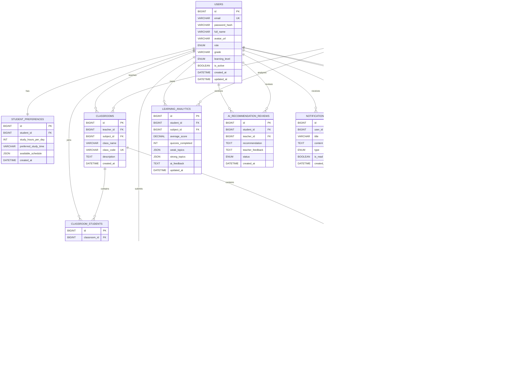
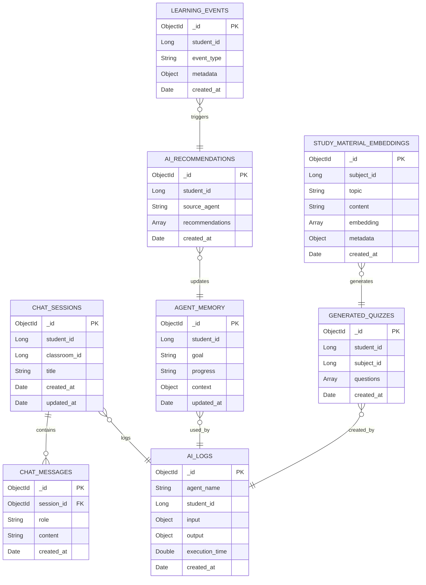

# Sơ đồ Quan hệ Thực thể (ER Diagram) — AI Learning Assistant Platform

Tài liệu này mô tả toàn bộ thiết kế cơ sở dữ liệu của hệ thống, bao gồm:
- **MySQL** (SQLAlchemy ORM): 16 bảng quan hệ — lưu trữ dữ liệu có cấu trúc, ràng buộc ACID.
- **MongoDB** (Motor Async): 8 collections — lưu trữ dữ liệu phi cấu trúc, linh hoạt cho AI.

---

## 🗄️ MySQL — ER Diagram



---

## 🍃 MongoDB — Collection Schemas



---

## 🔍 Chú thích Thiết kế Quan trọng

### MySQL

| # | Quan hệ | Giải thích |
|---|---------|-----------|
| 1 | `USERS` → `STUDENT_PREFERENCES` | **1-1**: Mỗi học sinh có đúng 1 bộ cài đặt học tập. |
| 2 | `USERS` → `CLASSROOMS` | Một giáo viên quản lý nhiều lớp. |
| 3 | `CLASSROOMS` ↔ `USERS` | **N-N** qua `CLASSROOM_STUDENTS`: Học sinh tham gia nhiều lớp. |
| 4 | `SUBJECTS` → `CLASSROOMS` | **1-N**: Một môn học có nhiều lớp học giảng dạy, mỗi lớp chỉ thuộc về 1 môn. |
| 5 | `STUDY_GOALS` → `STUDY_PLANS` | Mỗi mục tiêu sinh ra nhiều task học tập theo ngày. |
| 6 | `STUDY_PLANS` → `STUDY_PLAN_PROGRESS` | Theo dõi % hoàn thành từng task (cập nhật nhiều lần). |
| 7 | `QUESTION_BANK` ↔ `QUIZZES` | **N-N** qua `QUESTIONS`: Câu hỏi từ kho được tái sử dụng trên nhiều đề. |
| 8 | `LEARNING_ANALYTICS` | Tổng hợp điểm và điểm yếu/mạnh theo từng môn — đầu vào cho Recommendation Agent. |
| 9 | `AI_RECOMMENDATION_REVIEWS` | HITL: Giáo viên xem xét và phê duyệt đề xuất AI trước khi gửi học sinh. |

### MongoDB

| Collection | Mục đích |
|-----------|---------|
| `chat_sessions` | Phiên hội thoại Chat Tutor (1 học sinh, nhiều phiên). |
| `chat_messages` | Lịch sử tin nhắn theo phiên — Conversation Memory cho AI. |
| `ai_logs` | Giám sát Input/Output mỗi lần gọi Agent — phục vụ debug & fine-tuning. |
| `ai_recommendations` | Đề xuất ôn tập của AI, chờ sync sang MySQL sau khi giáo viên duyệt. |
| `study_material_embeddings` | Vector store cho RAG — tài liệu học được chunk & encode. |
| `learning_events` | Stream sự kiện học tập real-time → kích hoạt Recommendation Agent. |
| `generated_quizzes` | Đề thi nháp do AI sinh — lưu tạm trước khi giáo viên xác nhận vào MySQL. |
| `agent_memory` | LangGraph persistent state — Agent nhớ tiến trình qua nhiều phiên. |

---

## ⚡ Luồng Dữ liệu Hybrid Database

```
Học sinh làm bài quiz
        │
        ▼
MySQL: quiz_attempts ──► Celery Task ──► LearningAnalyticsAgent
                                                │
                              ┌─────────────────┼─────────────────┐
                              ▼                 ▼                 ▼
                    MySQL: learning_analytics   MongoDB: ai_logs  MongoDB: learning_events
                              │
                              ▼
                    RecommendationAgent ──► MongoDB: ai_recommendations
                              │
                              ▼
                    MySQL: ai_recommendation_reviews (status=pending)
                              │
                    Giáo viên phê duyệt (HITL)
                              │
                              ▼ (status=approved)
                    MySQL: study_plans (task ôn tập mới)
                              │
                              ▼
                    MySQL: notifications (thông báo học sinh)
```
