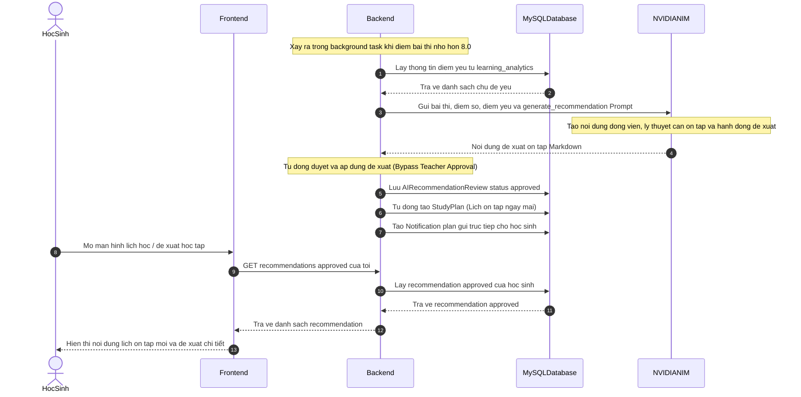

# BÁO CÁO KỸ THUẬT: ĐẶC TẢ CHI TIẾT CÁC NGHIỆP VỤ AI DÀNH CHO HỌC SINH (STUDENT AI SYSTEM)
## HỆ THỐNG HỌC TẬP THÔNG MINH - EDU-MIND

Tài liệu này đặc tả chi tiết thiết kế kỹ thuật, cấu trúc luồng dữ liệu Đầu vào (Inputs) - Đầu ra (Outputs), cùng với **sơ đồ tuần tự (Sequence Diagram) độc lập** và giải thích chi tiết từng bước cho từng nghiệp vụ AI dành cho học sinh trong hệ thống **EDU-MIND**.

---

## NGHIỆP VỤ 1: LẬP LỘ TRÌNH HỌC TRỌN GÓI & THẢO LUẬN TINH CHỈNH (UNIFIED PATH PLANNER & CONFIRMATION)

### 1. Mô tả nghiệp vụ
Cho phép học sinh lập mục tiêu học tập (điểm số, hạn chót, thời gian rảnh), sinh lộ trình nháp (Draft), chat thảo luận với AI Gia sư để sửa đổi lộ trình theo ý muốn, và chỉ lưu chính thức vào cơ sở dữ liệu MySQL khi học sinh hài lòng (Xác nhận - Confirm).

### 2. Sơ đồ tuần tự nghiệp vụ (Sequence Diagram)

sequenceDiagram
    autonumber

    actor Student as HocSinh

    participant FE as Frontend
    participant BE as Backend
    participant MySQL
    participant MongoDB
    participant Redis
    participant LLM

    Student->>FE: Nhap muc tieu hoc tap va lich ranh

    FE->>BE: POST goals unified

    Note over BE: Thuc hien RAG tim tai lieu lien quan

    BE->>MongoDB: Vector Search tai lieu hoc tap
    MongoDB-->>BE: Top 3 tai lieu phu hop

    Note over BE: Lay du lieu hoc luc hien tai

    BE->>MySQL: Lay diem trung binh diem manh diem yeu
    MySQL-->>BE: Ho so hoc luc

    BE->>LLM: Tao lo trinh hoc tap ca nhan hoa

    LLM-->>BE: Unified Goal Plan

    BE->>Redis: Save draft plan

    BE->>MongoDB: Save chat session

    BE-->>FE: Return session id va draft plan

    FE-->>Student: Hien thi lo trinh nhap

    Student->>FE: Yeu cau dieu chinh lo trinh

    FE->>BE: Tutor message

    BE->>Redis: Load draft plan

    Redis-->>BE: Current draft

    BE->>LLM: Refine study plan

    LLM-->>BE: Updated study plan

    BE->>Redis: Update draft plan

    BE-->>FE: Return updated plan

    FE-->>Student: Hien thi lo trinh moi

    Student->>FE: Confirm study plan

    FE->>BE: POST confirm goal

    BE->>Redis: Load final draft

    Redis-->>BE: Final draft plan

    BE->>MySQL: Save StudyGoal
    BE->>MySQL: Save StudyPlans
    BE->>MySQL: Save Quizzes
    BE->>MySQL: Save Questions

    BE->>Redis: Delete draft

    BE-->>FE: Save success

    FE-->>Student: Activate learning plan
### 3. Giải thích chi tiết luồng nghiệp vụ
1.  **Khởi tạo lộ trình nháp (Bước 1 - 9)**: Học sinh cung cấp các yêu cầu mục tiêu. Hệ thống tự động làm giàu dữ liệu bằng cách Vector Search tài liệu liên quan trong MongoDB và truy xuất học lực của học sinh từ MySQL. Prompt gửi lên LLM yêu cầu trả về cấu trúc tuần học, ngày học, giáo trình và bài kiểm tra thử.
2.  **Bộ nhớ đệm tạm thời (Bước 10 - 12)**: Dữ liệu JSON lộ trình siêu lớn được lưu vào **Redis Cache** với khóa `unified_draft:{session_id}` trong 30 phút. Tránh ghi thẳng vào ổ cứng MySQL khi chưa chốt.
3.  **Tương tác tinh chỉnh (Bước 13 - 19)**: Khi học sinh chat muốn sửa đổi, API nhận dạng ý định là `refine_plan`. Hệ thống lấy lộ trình nháp từ Redis, kết hợp tin nhắn sửa đổi của người dùng rồi yêu cầu LLM hiệu chỉnh lại đối tượng JSON. Redis được cập nhật bản nháp mới nhất.
4.  **Đồng bộ MySQL (Bước 20 - 27)**: Khi nhấn xác nhận, API confirm lấy bản nháp hoàn chỉnh từ Redis, khởi tạo cấu trúc dữ liệu quan hệ lưu vào MySQL (bảng `study_goals`, `study_plans`, `quizzes`, `questions`), xóa cache Redis và kết thúc quy trình nháp.

### 4. Chi tiết cấu trúc dữ liệu Đầu vào & Đầu ra (Inputs & Outputs)

#### a) Đầu vào (Inputs)
*   **Tham số API Client gửi lên**:
    *   **Sinh bản nháp & tinh chỉnh**: `POST /api/v1/goals/unified/draft`
        *   *Body (StudyGoalDraftCreate)*:
            ```json
            {
              "subject_id": 1,
              "target_score": 8.5,
              "deadline": "2026-07-31",
              "session_id": "string (Optional - ID phiên chat cũ nếu học sinh chat tinh chỉnh)",
              "user_message": "string (Optional - Yêu cầu tinh chỉnh của học sinh, ví dụ: 'Tôi muốn học ít hơn vào thứ bảy')",
              "available_schedule": {
                "mon": {"morning": true, "afternoon": false, "evening": true},
                "tue": {"morning": true, "afternoon": true, "evening": true},
                "wed": {"morning": false, "afternoon": true, "evening": true},
                "thu": {"morning": true, "afternoon": false, "evening": true},
                "fri": {"morning": true, "afternoon": True, "evening": false},
                "sat": {"morning": false, "afternoon": false, "evening": false},
                "sun": {"morning": false, "afternoon": false, "evening": false}
              }
            }
            ```
    *   **Xác nhận lưu chính thức**: `POST /api/v1/goals/unified/confirm`
        *   *Body (StudyGoalConfirm)*:
            ```json
            {
              "session_id": "string (UUID phiên chat nháp đã sinh)",
              "subject_id": 1,
              "target_score": 8.5,
              "deadline": "2026-07-31",
              "available_schedule": {
                "mon": {"morning": true, "afternoon": false, "evening": true},
                "tue": {"morning": True, "afternoon": true, "evening": true},
                "wed": {"morning": false, "afternoon": true, "evening": true},
                "thu": {"morning": true, "afternoon": false, "evening": true},
                "fri": {"morning": true, "afternoon": true, "evening": false},
                "sat": {"morning": false, "afternoon": false, "evening": false},
                "sun": {"morning": false, "afternoon": false, "evening": false}
              }
            }
            ```
*   **Truy xuất cơ sở dữ liệu nội bộ (Internal Reads)**:
    *   **MySQL**: Lấy cấu hình thời gian rảnh rỗi từ bảng `student_preferences` của học sinh tương ứng (`study_hours_per_day`, `preferred_study_time`, `available_schedule`) để lập lịch học khớp với thời gian rảnh.
    *   **MongoDB**: Lấy lịch sử hội thoại gần nhất từ collection `chat_messages` nếu người dùng truyền `session_id` để AI làm căn cứ hiệu chỉnh lộ trình cũ.
    *   **MongoDB Vector Search (RAG Context)**: Từ chủ đề cần lập lộ trình học, hệ thống tạo Vector Embedding (mô hình `nvidia/nv-embed-v1` 4096 chiều) và tìm kiếm sự tương đồng cosine trên collection `study_material_embeddings` có cùng `subject_id` để chọn ra **Top 3** tài liệu giảng dạy làm ngữ cảnh chính xác cho AI sinh lộ trình.
*   **Dữ liệu gửi đến AI (LLM Prompt & Response Structure)**:
    *   Hệ thống chuyển giao diện dữ liệu (System Prompt + RAG Context + Preferences) bắt buộc mô hình trả về định dạng JSON nghiêm ngặt khớp với cấu trúc `UnifiedGoalPlanResponse` (bao gồm lộ trình các tuần học `weeks`, thời khóa biểu chi tiết hàng ngày `daily_schedule`, tài liệu học tập chuẩn hóa `curriculum_materials`, các đề thi thử trắc nghiệm nháp `quizzes`).

#### b) Đầu ra (Outputs)
*   **Ghi nhận bộ nhớ đệm (Cache Writes)**:
    *   **Redis**: Lưu trữ lộ trình nháp (Draft Plan) có định dạng JSON đầy đủ của `UnifiedGoalPlanResponse` kèm các trường metadata (`_subject_id`, `_subject_name`, `_target_score`, `_deadline`, `_student_id`) với khóa `unified_draft:{session_id}`, thời gian hết hạn TTL là 1800 giây (30 phút).
*   **Ghi nhận Database (Internal Writes)**:
    *   **MongoDB**: 
        *   Tạo bản ghi mới trong collection `chat_sessions` (nếu bắt đầu lộ trình mới).
        *   Lưu lịch sử tin nhắn của học sinh (`role: 'user'`) và lộ trình JSON thô của AI (`role: 'assistant'`) vào collection `chat_messages`.
    *   **MySQL (Chỉ thực hiện khi Xác nhận - Confirm)**:
        *   Lưu 1 dòng vào bảng `study_goals` làm mục tiêu tổng quản.
        *   Lưu nhiều dòng nhiệm vụ học tập chi tiết hàng ngày vào bảng `study_plans` (trạng thái mặc định: `todo`).
        *   Lưu thông tin đề kiểm tra vào bảng `quizzes` (đánh dấu `generated_by_ai` = `true`).
        *   Lưu chi tiết từng câu hỏi vào bảng `question_bank` (options, correct_answer, explanation).
        *   Tạo liên kết khóa ngoại nhiều-nhiều trong bảng junction `questions` (`quiz_id` và `question_bank_id`).
*   **Dữ liệu phản hồi API (API Response)**:
    *   **Response Draft**:
        ```json
        {
          "message": "Sinh lộ trình nháp hợp nhất thành công!",
          "session_id": "d0be137e-c852-4752-944a-d698e5d326df",
          "plan": { ...cấu trúc UnifiedGoalPlanResponse... }
        }
        ```
    *   **Response Confirm**:
        ```json
        {
          "message": "Xác nhận và lưu lộ trình hợp nhất chính thức thành công!",
          "goal": {
            "id": 12,
            "title": "Lộ trình học Lập trình Java - Mục tiêu 8.5/10",
            "subject_id": 1,
            "target_score": 8.5,
            "deadline": "2026-07-31",
            "status": "active",
            "created_at": "2026-06-24T14:35:00"
          },
          "total_plans": 24,
          "total_quizzes": 4
        }
        ```


---

## NGHIỆP VỤ 2: TỰ ĐỘNG CHẤM ĐIỂM & ĐÁNH GIÁ HỌC LỰC (AUTO-GRADING & LEARNING ANALYTICS)

### 1. Mô tả nghiệp vụ
Chấm điểm bài làm của học sinh ngay lập tức bằng dữ liệu hệ thống (MCQ Auto-Grading), đồng thời kích hoạt luồng xử lý ngầm (Background Task) để gọi AI đánh giá năng lực học tập định kỳ và cập nhật hồ sơ học thuật của học sinh.

### 2. Sơ đồ tuần tự nghiệp vụ (Sequence Diagram)
sequenceDiagram
    autonumber

    actor Student as HocSinh
    participant FE as Frontend
    participant BE as Backend
    participant DB_MySQL as MySQLDatabase
    participant LLM as NVIDIANIM

    Student->>FE: Nhan nop bai lam trac nghiem

    FE->>BE: POST submit quiz

    BE->>DB_MySQL: Lay dap an dung tu question_bank

    DB_MySQL-->>BE: Tra ve danh sach dap an dung

    Note over BE: So khop dap an va tinh diem

    BE->>DB_MySQL: Luu QuizAttempt score correct_count wrong_count

    BE-->>FE: Tra ket qua cham diem

    FE-->>Student: Hien thi diem so

    Note over BE: Kich hoat background task

    BE->>DB_MySQL: Lay lich su QuizAttempt

    DB_MySQL-->>BE: Tra ve lich su diem so

    BE->>LLM: Evaluate learning performance

    Note over LLM: Phan tich xu huong diem manh diem yeu

    LLM-->>BE: LearningAnalyticsResponse

    Note over BE: Xu ly du lieu AI tra ve

    BE->>DB_MySQL: Update learning_analytics

### 3. Giải thích chi tiết luồng nghiệp vụ
1.  **Chấm điểm phi LLM (Bước 1 - 7)**: Để tránh độ trễ của mô hình ngôn ngữ lớn làm ảnh hưởng trải nghiệm người dùng, nghiệp vụ chấm bài trắc nghiệm lựa chọn (MCQ) và Đúng/Sai được xử lý trực tiếp bằng code logic thông thường, so sánh với đáp án chuẩn lưu trong MySQL database, lưu bản ghi `QuizAttempt` và trả điểm ngay cho Frontend.
2.  **Tác vụ nền bất đồng bộ (Bước 8)**: Quá trình phân tích học lực là một tác vụ nặng, Backend đưa vào hàng đợi `BackgroundTasks` của FastAPI để giải phóng API submit ngay.
3.  **Tác tử phân tích học lực (Bước 9 - 13)**: Hệ thống lấy dữ liệu toàn bộ lịch sử thi môn học này của học sinh từ trước đến nay gửi đến **Analytics Agent**. Tác tử này phân tích xem điểm trung bình từng chủ đề thế nào (chủ đề nào < 6.5 xếp vào `weak_topics`, >= 8.0 xếp vào `strong_topics`), đánh giá xu hướng tiến triển (`improving`/`declining`/`stable`), viết nhận xét học thuật và lưu ngược lại vào bảng `learning_analytics` trong MySQL.

### 4. Chi tiết cấu trúc dữ liệu Đầu vào & Đầu ra (Inputs & Outputs)

#### a) Đầu vào (Inputs)
*   **Tham số API Client gửi lên**:
    *   **Nộp bài thi**: `POST /api/v1/quizzes/{quiz_id}/submit`
        *   *Path Parameter*: `quiz_id` (int - ID của đề thi trắc nghiệm)
        *   *Body (QuizAttemptCreate)*:
            ```json
            {
              "answers": [
                { "question_bank_id": 15, "answer": "C" },
                { "question_bank_id": 16, "answer": "True" }
              ],
              "duration_seconds": 180
            }
            ```
*   **Truy xuất cơ sở dữ liệu nội bộ (Internal Reads)**:
    *   **MySQL (Phần chấm điểm trực tiếp)**: Truy vấn danh sách đáp án đúng từ bảng `question_bank` thông qua liên kết khóa ngoại của bảng junction `questions` với `quiz_id` của đề thi đang chấm.
    *   **MySQL (Phần đánh giá học lực - Background Task)**: Truy vấn tất cả bản ghi thi cũ (`quiz_attempts` tham chiếu tới môn học `subject_id`) của học sinh này để tính điểm trung bình (`average_score`) và tổng số lượng bài đã làm (`quizzes_completed`).
*   **Dữ liệu gửi đến AI (LLM Prompt)**:
    *   Gọi **Analytics Agent** truyền danh sách lịch sử thi có cấu trúc: `attempts_history` gồm danh sách các đối tượng chứa: `topic` (chủ đề đề thi), `score` (điểm đạt được), `is_passed` (đạt/không đạt). AI nhận diện xu hướng tiến bộ và chỉ ra các chủ đề cụ thể bị hổng kiến thức.

#### b) Đầu ra (Outputs)
*   **Ghi nhận Database (Internal Writes)**:
    *   **MySQL (Chấm điểm)**: Tạo mới bản ghi lượt thi trong bảng `quiz_attempts` chứa: `quiz_id`, `student_id`, `score`, `correct_count`, `wrong_count`, `duration_seconds` và trường `answers` lưu mảng kết quả chi tiết JSON: `[{"question_bank_id": 15, "answer": "C", "is_correct": true}]`.
    *   **MySQL (Background Task)**: 
        *   Cập nhật hoặc tạo mới bản ghi học lực môn học trong bảng `learning_analytics`, ghi nhận `average_score`, `quizzes_completed`, danh sách các chủ đề yếu `weak_topics` (dưới dạng mảng đối tượng JSON), danh sách chủ đề giỏi `strong_topics` (dạng JSON), và nhận xét học thuật tổng quan của AI `ai_feedback`.
        *   Thêm bản ghi thông báo mới có loại `score` vào bảng `notifications` để báo cho học sinh biết hồ sơ học lực đã được cập nhật đánh giá xong.
*   **Dữ liệu phản hồi API (API Response)**:
    *   Trả về kết quả chấm điểm tức thì dạng `QuizAttemptResponse`:
        ```json
        {
          "id": 105,
          "quiz_id": 2,
          "student_id": 10,
          "answers": [
            { "question_bank_id": 15, "answer": "C" },
            { "question_bank_id": 16, "answer": "True" }
          ],
          "score": 10.0,
          "correct_count": 2,
          "wrong_count": 0,
          "duration_seconds": 180,
          "submitted_at": "2026-06-24T14:40:00Z"
        }
        ```


---

## NGHIỆP VỤ 3: SINH ĐỀ KIỂM TRA TỰ ĐỘNG DỰ RÊN RAG (RAG QUIZ GENERATOR)

### 1. Mô tả nghiệp vụ
Tự động thiết kế đề thi thử trắc nghiệm dựa trên chủ đề yêu cầu và ngữ cảnh tài liệu giảng dạy thực tế được trích xuất từ cơ sở dữ liệu MongoDB bằng kỹ thuật tìm kiếm vector (RAG).

### 2. Sơ đồ tuần tự nghiệp vụ (Sequence Diagram)

sequenceDiagram
    autonumber

    participant User
    participant FE
    participant BE
    participant DB_MySQL
    participant DB_Mongo
    participant LLM

    User->>FE: Nhap yeu cau sinh de thi

    FE->>BE: Generate Quiz Request

    Note over BE: Thuc hien RAG Vector Search

    BE->>BE: Tao embedding cho topic

    BE->>DB_Mongo: Tim tai lieu lien quan

    DB_Mongo-->>BE: Tra ve RAG Context

    BE->>LLM: Quiz Generator Prompt + RAG Context

    Note over LLM: Tao cau hoi dap an va giai thich

    LLM-->>BE: QuizResponse JSON

    Note over BE: Phan tich du lieu JSON

    BE->>DB_MySQL: Tao ban ghi Quiz

    BE->>DB_MySQL: Luu Questions

    BE-->>FE: Tra ve Quiz ID

    FE-->>User: Hien thi de thi san sang


### 3. Giải thích chi tiết luồng nghiệp vụ
1.  **Vector Search ngữ nghĩa (Bước 1 - 5)**: Hệ thống sinh mã nhúng vector từ chuỗi ký tự chủ đề người dùng nhập bằng mô hình `nvidia/nv-embed-v1` và thực hiện tìm kiếm sự tương đồng cosine trong MongoDB để lấy ra tài liệu chuẩn của môn học.
2.  **Sinh câu hỏi có căn cứ (Bước 6 - 8)**: Gửi nội dung tài liệu này làm ngữ cảnh nền (RAG Context) cho **Quiz Generator Agent**. Ràng buộc prompt yêu cầu các câu hỏi phải bám sát tài liệu được cung cấp để tránh hiện tượng AI tự bịa kiến thức (hallucination). Mô hình trả về JSON gồm danh sách câu hỏi, các lựa chọn, đáp án đúng và phần giải thích chi thuyết học thuật.
3.  **Lưu trữ quan hệ (Bước 9 - 12)**: Dữ liệu đề thi và câu hỏi được backend bóc tách, lưu vào cấu trúc bảng quan hệ trong MySQL và trả về ID đề thi phục vụ cho học sinh vào làm bài.

### 4. Chi tiết cấu trúc dữ liệu Đầu vào & Đầu ra (Inputs & Outputs)

#### a) Đầu vào (Inputs)
*   **Tham số API Client gửi lên**:
    *   **Yêu cầu sinh đề thi**: `POST /api/v1/quizzes/generate`
        *   *Body (QuizCreateRequest)*:
            ```json
            {
              "classroom_id": 5,
              "subject_id": 1,
              "topic": "Lập trình đa luồng (Multithreading) trong Java",
              "difficulty": "hard",
              "total_questions": 5,
              "question_type": "mcq"
            }
            ```
*   **Truy xuất cơ sở dữ liệu nội bộ (Internal Reads)**:
    *   **MySQL**: Đọc bảng `subjects` bằng `subject_id` để lấy tên môn học chính thức cấp cho Prompt.
    *   **MongoDB Vector Search (RAG)**: Tạo mã nhúng Vector Embedding từ chuỗi `topic` người dùng gửi lên. Thực hiện truy vấn Vector trên collection `study_material_embeddings` lọc theo `subject_id` để trích xuất **Top 3** khối tài liệu giảng dạy chuẩn có độ tương đồng cosine cao nhất làm ngữ cảnh.
*   **Dữ liệu gửi đến AI (LLM Prompt & Context)**:
    *   Gọi **Quiz Generator Agent** truyền tham số: `subject` (tên môn học), `topic` (chủ đề), `difficulty` (độ khó), `total_questions` (số câu hỏi), `question_type` (dạng MCQ hay True/False), và `context` (toàn bộ nội dung văn bản giáo trình RAG tìm được ở bước trên).

#### b) Đầu ra (Outputs)
*   **Ghi nhận Database (Internal Writes)**:
    *   **MongoDB**: Đối với mỗi câu hỏi trắc nghiệm AI vừa tạo ra, hệ thống tự động sinh vector biểu diễn của câu hỏi đó và lưu tài liệu nhúng vào collection `study_material_embeddings` với trường metadata `"type": "question"` để phục vụ tìm kiếm/tái sử dụng về sau.
    *   **MySQL**:
        *   Tạo 1 bản ghi mới trong bảng `quizzes` (`classroom_id` = 5, `subject_id` = 1, `teacher_id` = ID giáo viên tạo đề (NULL nếu do học sinh tự sinh), `title`, `difficulty` = 'hard', `total_questions` = 5, `generated_by_ai` = `true`).
        *   Tạo 5 bản ghi mới trong bảng `question_bank` chứa nội dung câu hỏi, danh sách các phương án trả lời JSON, đáp án đúng, giải thích lý thuyết chi tiết, và khóa liên kết vector `embedding_id` trỏ sang MongoDB.
        *   Tạo 5 bản ghi liên kết khóa ngoại vào bảng junction `questions` kết nối `quiz_id` với `question_bank_id`.
*   **Dữ liệu phản hồi API (API Response)**:
    *   Trả về thông tin đề thi và danh sách câu hỏi đã được ẩn đáp án chuẩn (`QuizResponse`):
        ```json
        {
          "id": 9,
          "classroom_id": 5,
          "subject_id": 1,
          "teacher_id": null,
          "title": "Bài kiểm tra Lập trình Java - Lập trình đa luồng (Multithreading) trong Java",
          "difficulty": "hard",
          "total_questions": 5,
          "generated_by_ai": true,
          "created_at": "2026-06-24T14:45:00Z",
          "questions": [
            {
              "id": 86,
              "subject_id": 1,
              "topic": "Lập trình đa luồng (Multithreading) trong Java",
              "difficulty": "hard",
              "question_text": "Phương thức nào sau đây được gọi để khởi chạy một luồng mới trong Java?",
              "options": [
                { "key": "A", "value": "run()" },
                { "key": "B", "value": "start()" },
                { "key": "C", "value": "init()" },
                { "key": "D", "value": "execute()" }
              ],
              "created_by": null,
              "embedding_id": "648a12bc7d85c490a123e789",
              "created_at": "2026-06-24T14:45:00Z"
            }
          ]
        }
        ```


---

## NGHIỆP VỤ 4: GIA SƯ ẢO TƯƠNG TÁC CÁ NHÂN HÓA (AI CHAT TUTOR)

### 1. Mô tả nghiệp vụ
Giải đáp thắc mắc bài học và câu hỏi lý thuyết cho học sinh. Tự động liên kết lịch sử hội thoại trước đó và dữ liệu học lực (điểm số, điểm yếu) của học sinh để điều chỉnh nội dung trả lời phù hợp nhất.

### 2. Sơ đồ tuần tự nghiệp vụ (Sequence Diagram)

sequenceDiagram
    autonumber

    actor Student as HocSinh

    participant FE as Frontend
    participant BE as Backend
    participant DB_MySQL as MySQLDatabase
    participant DB_Mongo as MongoDB
    participant Cache as Redis
    participant LLM as NVIDIANIM

    Student->>FE: Gui cau hoi hoc tap

    FE->>BE: POST tutor message stream (session_id, message)

    Note over BE: Doc lich su chat va tom tat hoi thoai

    BE->>Cache: Lay chat_summary

    Cache-->>BE: Tra ve ban tom tat neu co

    BE->>DB_Mongo: Lay lich su tin nhan gan nhat

    DB_Mongo-->>BE: Tra ve lich su tin nhan

    Note over BE: Truy xuat hoc luc hoc sinh

    BE->>DB_MySQL: Lay LearningAnalytic diem trung binh diem yeu

    DB_MySQL-->>BE: Tra ve diem manh va diem yeu

    BE->>LLM: CHAT_TUTOR_SYSTEM_PROMPT + Chat History + Learning Analytics

    Note over LLM: Dong vai gia su ao va giai thich kien thuc tung buoc

    loop Stream Response

        LLM-->>BE: Stream token

        BE-->>FE: Stream token

        FE-->>Student: Hien thi phan hoi theo thoi gian thuc

    end

    BE->>DB_Mongo: Luu tin nhan cua HocSinh va AI

    Note over BE: Kich hoat tom tat hoi thoai neu lich su qua dai

    BE->>Cache: Cap nhat chat_summary moi nhat

### 3. Giải thích chi tiết luồng nghiệp vụ
1.  **Thiết lập ngữ cảnh cá nhân hóa (Bước 1 - 9)**: API tự động tải tóm tắt hội thoại và tin nhắn lịch sử của phiên làm việc. Đồng thời truy cập bảng `learning_analytics` lấy điểm số và điểm yếu môn học này của học sinh nhằm cá nhân hóa câu trả lời (Ví dụ: Biết học sinh yếu phần Triết học Mác, AI sẽ giải thích khái niệm cặn kẽ hơn).
2.  **Streaming & Prompt Sư phạm (Bước 10 - 13)**: Tác tử sử dụng hệ thống prompt `CHAT_TUTOR_SYSTEM_PROMPT` bắt buộc phải trả lời thân thiện, sử dụng phương pháp Socratic hướng dẫn từng bước tư duy thay vì trực tiếp đưa ra đáp án bài tập. Phản hồi được truyền về Frontend dạng luồng ký tự (stream) để học sinh không cần đợi lâu.
3.  **Quản lý bộ nhớ (Bước 14 - 16)**: Lưu hội thoại vào MongoDB. Nếu độ dài hội thoại vượt giới hạn, hệ thống chạy ngầm luồng tóm tắt nội dung chính và lưu vào cache Redis để tối ưu hóa token cho những lượt gọi sau.

### 4. Chi tiết cấu trúc dữ liệu Đầu vào & Đầu ra (Inputs & Outputs)

#### a) Đầu vào (Inputs)
*   **Tham số API Client gửi lên**:
    *   **Gửi tin nhắn (Nguyên khối)**: `POST /api/v1/chat/tutor/message`
        *   *Body (TutorMessageSend)*:
            ```json
            {
              "session_id": "648a12bc7d85c490a123f111 (ObjectId phiên chat)",
              "content": "Hãy giải thích ngắn gọn về cơ chế hoạt động của Garbage Collector trong Java."
            }
            ```
    *   **Gửi tin nhắn (Real-time SSE Streaming)**: `GET /api/v1/chat/tutor/stream`
        *   *Query Parameters*: `content` (str - Câu hỏi học sinh), `session_id` (str - ID phiên chat)
*   **Truy xuất cơ sở dữ liệu nội bộ (Internal Reads)**:
    *   **Redis Cache**: Đọc `chat_summary` để nạp tóm tắt nhanh của các lượt đối thoại cũ đã được nén trước đó.
    *   **MongoDB**: Truy cập collection `chat_messages` bằng `session_id` để lấy toàn bộ lịch sử các tin nhắn gửi nhận trước đó nhằm nạp vào ngữ cảnh của prompt.
    *   **MySQL**: Đọc bảng `learning_analytics` bằng `student_id` và môn học liên kết để lấy ra điểm số trung bình môn học hiện tại cùng danh sách các chủ đề yếu `weak_topics` và chủ đề nắm chắc `strong_topics`.
*   **Dữ liệu gửi đến AI (LLM Prompt)**:
    *   Hệ thống tích hợp: Prompt hướng dẫn sư phạm đặc thù `CHAT_TUTOR_SYSTEM_PROMPT` (yêu cầu không trả lời trực tiếp đáp án, chỉ gợi mở vấn đề theo phương pháp Socratic) + Tóm tắt hội thoại cũ (`chat_summary`) + Lịch sử tin nhắn gần đây + Dữ liệu học lực thực tế + Câu hỏi hiện tại của học sinh.

#### b) Đầu ra (Outputs)
*   **Ghi nhận Database & Bộ nhớ đệm (Internal Writes)**:
    *   **MongoDB**: Thêm 2 bản ghi mới vào collection `chat_messages` lưu tin nhắn gửi đi của học sinh (`role: 'user'`) và câu trả lời hoàn thiện của AI Gia sư (`role: 'assistant'`).
    *   **Redis Cache**: Khi độ dài các tin nhắn trong collection MongoDB vượt quá giới hạn Token cấu hình, hệ thống sẽ tự động chạy ngầm tác vụ tóm tắt nội dung hội thoại chính, ghi đè bản tóm tắt mới vào khóa `chat_summary:{session_id}` trong Redis Cache để tối ưu hóa bộ nhớ cho các lượt tương tác sau.
*   **Dữ liệu phản hồi API (API Response)**:
    *   **API Response (Nguyên khối)**:
        ```json
        {
          "reply": "Garbage Collector hoạt động bằng cách tự động dọn dẹp các đối tượng không còn được tham chiếu trong Heap Memory. Em có biết các thế hệ bộ nhớ Heap trong Java được phân chia như thế nào không?",
          "history": [
            { "role": "user", "content": "Hãy giải thích ngắn gọn về cơ chế hoạt động của Garbage Collector trong Java." },
            { "role": "assistant", "content": "Garbage Collector hoạt động bằng cách..." }
          ]
        }
        ```
    *   **API Response (SSE Streaming)**:
        ```
        data: Garbage
        data:  Collector
        data:  hoạt
        data:  động
        ...
        ```


---

## NGHIỆP VỤ 5: ĐỀ XUẤT ÔN TẬP TỰ ĐỘNG & BẢO LƯU LỊCH SỬ (AI RECOMMENDER)

### 1. Mô tả nghiệp vụ
Tự động biên soạn đề xuất học tập/ôn tập riêng khi học sinh làm bài thi đạt kết quả thấp (< 8.0). Để tối ưu hóa trải nghiệm học tập của học sinh, hệ thống không bắt buộc giáo viên phê duyệt thủ công (HITL bypass). Thay vào đó, đề xuất ôn tập từ AI sẽ được tự động chuyển trạng thái duyệt thành `approved` ngay lập tức, tự động tạo một nhiệm vụ học tập (`StudyPlan`) bổ sung vào ngày hôm sau cho học sinh, và gửi thông báo trực tiếp đến học sinh. Bản ghi vẫn được lưu trong bảng `ai_recommendation_reviews` với thông tin giáo viên phụ trách để phục vụ việc xem lại lịch sử bồi dưỡng/ôn tập.

### 2. Sơ đồ tuần tự nghiệp vụ (Sequence Diagram)



### 3. Giải thích chi tiết luồng nghiệp vụ
1.  **Kích hoạt ngầm (Bước 1 - 7)**: Khi điểm bài thi < 8.0, hệ thống tự động gọi **Recommender Agent** kết hợp dữ liệu điểm yếu cũ từ bảng `learning_analytics` để tạo lời khuyên cá nhân hóa.
2.  **Tự động áp dụng & Phân bổ lịch học (Bước 8 - 10)**: Backend tự động lưu bản ghi `AIRecommendationReview` ở trạng thái `"approved"`. Đồng thời, hệ thống tìm mục tiêu học tập (`StudyGoal`) của học sinh và tự động tạo mới một nhiệm vụ học tập (`StudyPlan`) cho ngày hôm sau lúc 19:00 - 20:00 chứa nội dung ôn tập của AI.
3.  **Thông báo trực tiếp cho Học sinh**: Hệ thống tạo thông báo gửi thẳng đến tài khoản của học sinh báo rằng lịch ôn tập AI đã được thêm vào lộ trình của họ. Giáo viên không cần duyệt thủ công nhưng vẫn có thể xem lại lịch sử các đề xuất đã được áp dụng này.

### 4. Chi tiết cấu trúc dữ liệu Đầu vào & Đầu ra (Inputs & Outputs)

#### a) Đầu vào (Inputs)
*   **Điều kiện kích hoạt ngầm (Background Trigger)**:
    *   Học sinh nộp bài thi thử (`POST /api/v1/quizzes/{quiz_id}/submit`) đạt số điểm dưới 8.0.
*   **Truy xuất cơ sở dữ liệu nội bộ (Internal Reads)**:
    *   **MySQL**:
        *   Truy cập bảng `learning_analytics` để lấy danh sách các điểm yếu `weak_topics` của học sinh.
        *   Tìm kiếm `StudyGoal` hoạt động của học sinh để gắn `StudyPlan` ôn tập mới.
*   **Dữ liệu gửi đến AI (LLM Prompt)**:
    *   Gọi **Recommender Agent** (`generate_recommendation`) với các tham số: `subject_name` (tên môn học), `topic_name` (chủ đề bài kiểm tra vừa làm), `score` (điểm thi cụ thể), và danh sách mảng đối tượng `weak_topics` từ hồ sơ học lực MySQL.

#### b) Đầu ra (Outputs)
*   **Ghi nhận Database (Internal Writes)**:
    *   **MySQL (Khi AI sinh tự động)**:
        *   Tạo mới 1 dòng trong bảng `ai_recommendation_reviews` ở trạng thái đã duyệt (`status` = `"approved"`, lưu nội dung Markdown ôn tập do AI thiết kế vào cột `recommendation`, cột `teacher_id` được gán theo giáo viên phụ trách lớp để theo dõi).
        *   Tạo mới 1 dòng trong bảng `study_plans` đại diện cho lịch ôn tập ngày mai của học sinh.
        *   Tạo mới 1 thông báo có `type` = `"plan"` trong bảng `notifications` gửi cho học sinh: *"Dựa trên kết quả bài [Quiz] đạt [Score]/10, AI đã tự động tạo lịch ôn tập mới cho bạn."*
*   **Dữ liệu phản hồi API (API Response)**:
    *   Học sinh hoặc Giáo viên có thể truy vấn đề xuất qua các API xem chi tiết (`GET /api/v1/recommendations/pending` cho giáo viên xem lịch sử hoặc API tương ứng cho học sinh).
          "created_at": "2026-06-24T15:00:00Z",
          "student": {
            "id": 10,
            "email": "hocsinh@school.edu.vn",
            "full_name": "Trần Văn Học"
          }
        }
        ```


---

## NGHIỆP VỤ 6: TỰ ĐỘNG ĐIỀU CHỈNH LỘ TRÌNH THÍCH ỨNG (ADAPTIVE PATHWAY ADJUSTMENT)

### 1. Mô tả nghiệp vụ
Khi học sinh làm bài thi thử đạt kết quả thấp dưới mức yêu cầu (điểm < 7.0) và tồn tại điểm yếu được phân tích, hệ thống tự động chèn yêu cầu hiệu chỉnh lộ trình và chuyển ngữ cảnh hội thoại của học sinh để Gia sư ảo điều hướng ôn tập lại phần yếu trước khi đi tiếp.

### 2. Sơ đồ tuần tự nghiệp vụ (Sequence Diagram)
sequenceDiagram
    autonumber

    actor Student as HocSinh
    actor Tutor as AITutor

    participant FE as Frontend
    participant BE as Backend
    participant DB_MySQL as MySQLDatabase
    participant DB_Mongo as MongoDB

    Note over BE: Xay ra trong background task khi diem bai thi nho hon 7.0

    BE->>DB_MySQL: Kiem tra active_goal cua mon hoc

    DB_MySQL-->>BE: Tra ve thong tin lo trinh active

    alt Co lo trinh active va ton tai diem yeu

        BE->>DB_Mongo: Tao phien chat moi dieu chinh lo trinh

        Note over BE: Tu dong tao yeu cau dieu chinh lo trinh

        BE->>DB_Mongo: Them tin nhan mo ta score va weak_topics

        BE->>DB_MySQL: Tao system notification gui hoc sinh

    end

    Student->>FE: Mo thong bao hoc tap thich ung

    FE->>BE: POST tutor message session

    Note over BE: Tai ngu canh hoi thoai tu MongoDB

    BE->>DB_Mongo: Lay lich su phien chat dieu chinh

    DB_Mongo-->>BE: Tra ve lich su hoi thoai

    BE->>Tutor: Xu ly hoi thoai thich ung

    Tutor-->>BE: Huong dan on tap diem yeu

    BE-->>FE: Tra ve noi dung bai hoc

    FE-->>Student: Hoc tap theo lo trinh thich ung
### 3. Giải thích chi tiết luồng nghiệp vụ
1.  **Phát hiện lỗ hổng & Kích hoạt ngầm (Bước 1 - 4)**: Luồng xử lý ngầm kiểm tra xem học sinh có lộ trình học tập đang hoạt động hay không. Nếu điểm thi mới nộp < 7.0 và có phần yếu, hệ thống kích hoạt tự động thích ứng.
2.  **Giả lập ý định học tập (Bước 5 - 6)**: Thay vì bắt học sinh tự viết yêu cầu điều chỉnh lộ trình phức tạp, hệ thống tự động khởi tạo một phiên chat mới trên MongoDB và tự chèn tin nhắn đóng vai học sinh: *"Tôi vừa làm bài thi X đạt điểm số thấp, điểm yếu là Y. Hãy điều chỉnh lộ trình"*.
3.  **Thông báo hệ thống (Bước 7)**: Học sinh nhận được thông báo về việc lộ trình được tinh chỉnh thích ứng.
4.  **Hướng dẫn ôn luyện tập trung (Bước 8 - 13)**: Khi học sinh nhấn vào cuộc hội thoại này, **AI Chat Tutor** sẽ đọc toàn bộ ngữ cảnh đã chèn sẵn cùng dữ liệu học lực, tự động điều chỉnh nội dung dạy học để tập trung giảng giải kiến thức yếu trước khi cho học sinh học tiếp các bài học của tuần tiếp theo.

### 4. Chi tiết cấu trúc dữ liệu Đầu vào & Đầu ra (Inputs & Outputs)

#### a) Đầu vào (Inputs)
*   **Điều kiện kích hoạt ngầm (Background Trigger)**:
    *   Học sinh nộp bài thi thử đạt điểm số dưới 7.0 (score < 7.0) đồng thời có danh sách chủ đề yếu trong hồ sơ học thuật môn học đó.
*   **Truy xuất cơ sở dữ liệu nội bộ (Internal Reads)**:
    *   **MySQL**:
        *   Đọc bảng `study_goals` để xác nhận học sinh đang có lộ trình học tập ở trạng thái `status` = `"active"`.
        *   Đọc bảng `learning_analytics` để trích xuất danh sách các chủ đề yếu `weak_topics` của học sinh.

#### b) Đầu ra (Outputs)
*   **Ghi nhận Database (Internal Writes)**:
    *   **MongoDB**:
        *   Tự động chèn 1 bản ghi mới vào collection `chat_sessions` đại diện cho một phiên chat ôn tập đặc biệt, với tiêu đề: `"Tự động điều chỉnh lộ trình - {subject_name} (Điểm yếu)"`.
        *   Tự động chèn 1 tin nhắn mới đóng vai người dùng (`role: 'user'`) vào collection `chat_messages` chứa nội dung giả lập ý định học tập: `"Tôi vừa làm bài '{quiz_title}' được {score}/10. Các phần yếu cần cải thiện: {weak_topics_str}. Hãy điều chỉnh lộ trình học tập của tôi để tập trung ôn các phần này."`
    *   **MySQL**:
        *   Tạo 1 bản ghi thông báo mới có `type` = `"plan"` trong bảng `notifications` gửi cho học sinh: *"Dựa trên kết quả bài thi '{quiz_title}' ({score}/10), AI đã phân tích điểm yếu và điều chỉnh lộ trình học tập môn {subject_name}. Vui lòng kiểm tra lại lộ trình."*
*   **Luồng tương tác tiếp diễn (Client-side Continuation)**:
    *   Khi học sinh bấm vào thông báo hoặc danh sách chat thích ứng, Frontend sẽ gọi API: `GET /api/v1/chat/tutor/messages/{session_id}` để tải toàn bộ lịch sử ngữ cảnh giả lập từ MongoDB.
    *   Học sinh tiến hành chat tiếp với **AI Chat Tutor** thông qua API `POST /api/v1/chat/tutor/message` hoặc `GET /api/v1/chat/tutor/stream`. Tác tử AI đọc tin nhắn giả lập của hệ thống cùng hồ sơ học lực MySQL để tự động chuyển hướng nội dung ôn tập giảng giải kiến thức yếu trước khi cho học sinh tiếp tục thực hiện lộ trình của các tuần học tiếp theo.

